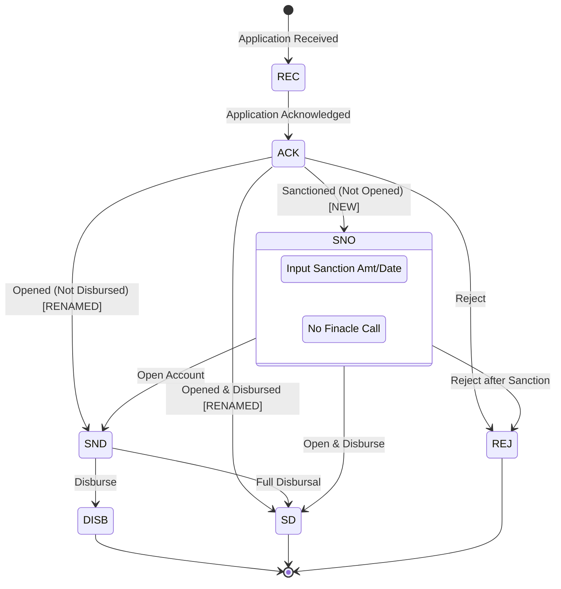

```mermaid
stateDiagram-v2
    [*] --> REC: Application Received
    REC --> ACK: Application Acknowledged
    
    ACK --> REJ: Reject
    ACK --> SNO: Sanctioned (Not Opened) [NEW]
    ACK --> SND: Opened (Not Disbursed) [RENAMED]
    ACK --> SD: Opened & Disbursed [RENAMED]

    state SNO {
        direction lr
        Manual_Entry: Input Sanction Amt/Date
        No_API: No Finacle Call
    }

    SNO --> REJ: Reject after Sanction
    SNO --> SND: Open Account
    SNO --> SD: Open & Disburse

    SND --> DISB: Disburse
    SND --> SD: Full Disbursal

    DISB --> [*]
    SD --> [*]
    REJ --> [*]

    classDef new fill:#f96,stroke:#333,stroke-width:2px;
    classDef renamed fill:#bbf,stroke:#333,stroke-width:1px,stroke-dasharray: 5 5;
    
    class SNO new;
    class SND,SD renamed;
```

